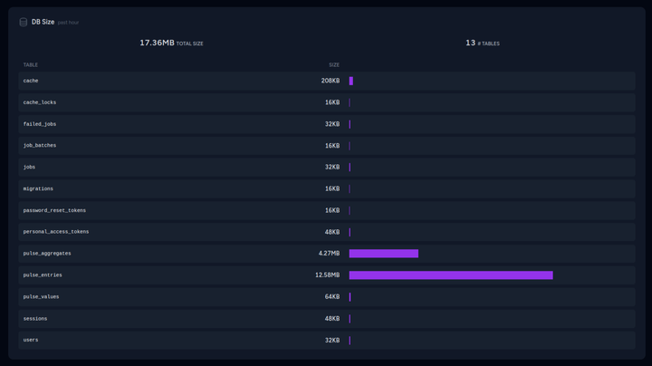

# Track database table size inside Pulse

This package provides the very same information from [Laravel Pulse](https://pulse.laravel.com) as a JSON api endpoint.

## Installation

You can install the package via composer:

```shell
composer require robertogallea/pulse-db-size
```

## Usage

## Configuration

Add the provided recorder to your `config/pulse.php` configuration file as follows.

```php
'recorders' => [
        // ...
        
        \Robertogallea\PulseDBSize\Recorders\DBSizeRecorder::class => [
            'enabled' => env('PULSE_DB_SIZE_RECORDER_ENABLED', true), // recorder switch
            'throttle' => env('PULSE_DB_SIZE_RECORDER_THROTTLE', 15), // throttling time before refreshing table size
            'connection' => env('PULSE_DB_SIZE_RECORDER_CONNECTION', 'default'), // database connection to use
        ],
]
```

### Usage

Add the card to your dashboard by editing `resources/views/vendor/pulse/dashboard.blade.php`

```html
<x-pulse>
    <livewire:pulse.dbsize cols="full" expand />

   ...
</x-pulse>
```

## Changelog

Please see [CHANGELOG](CHANGELOG.md) for more information on what has changed recently.

## Credits

-   [Roberto Gallea](https://github.com/robertogallea)
-   [All Contributors](../../contributors)

## License

The MIT License (MIT). Please see [License File](LICENSE.md) for more information.